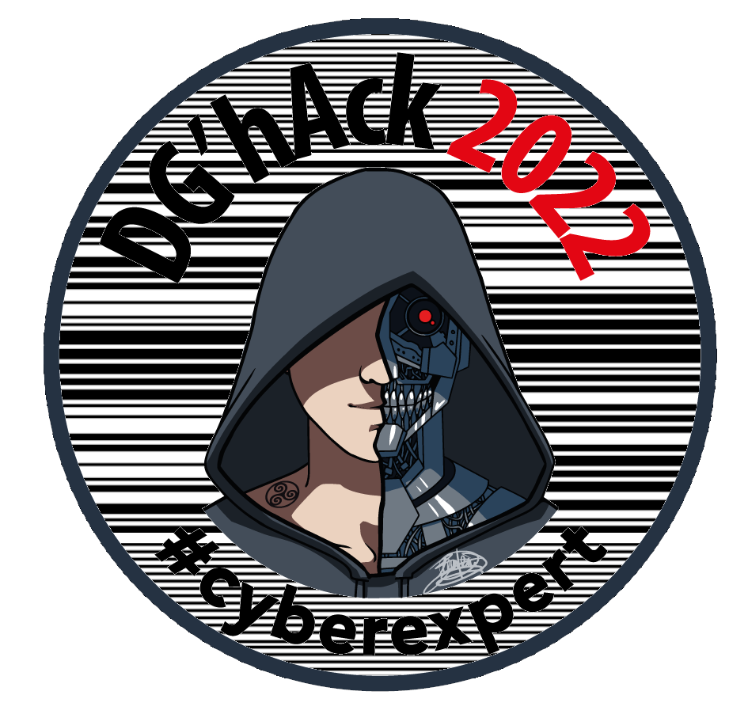
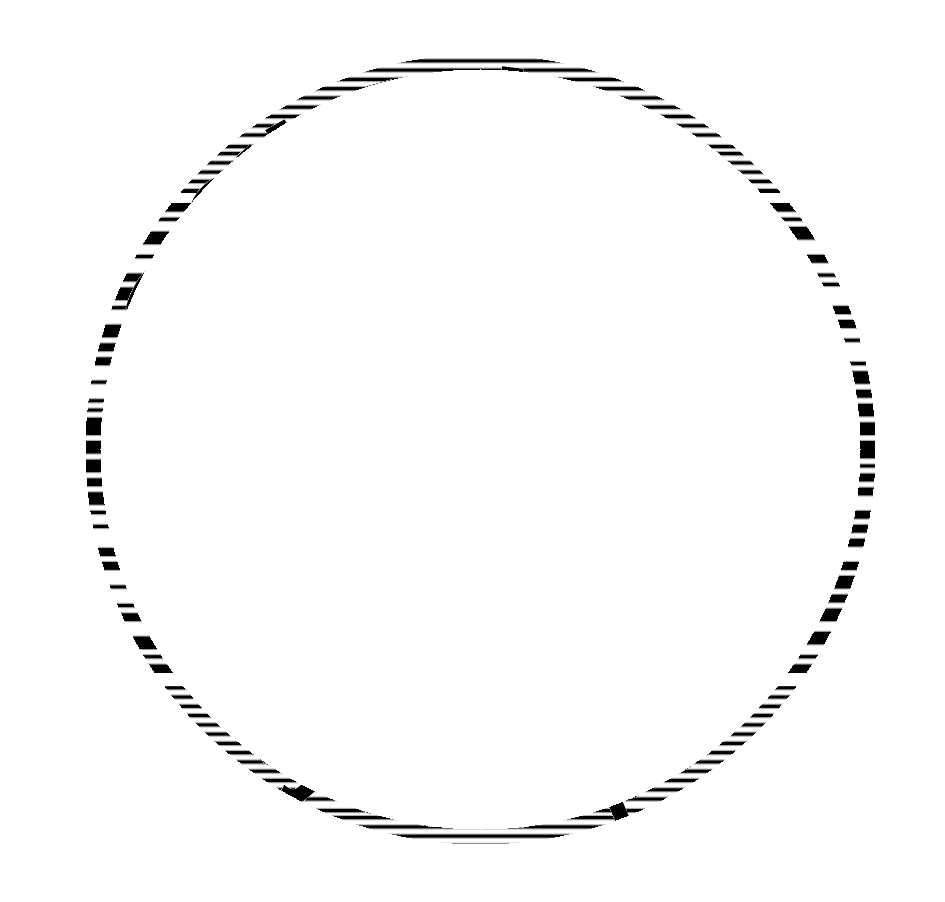
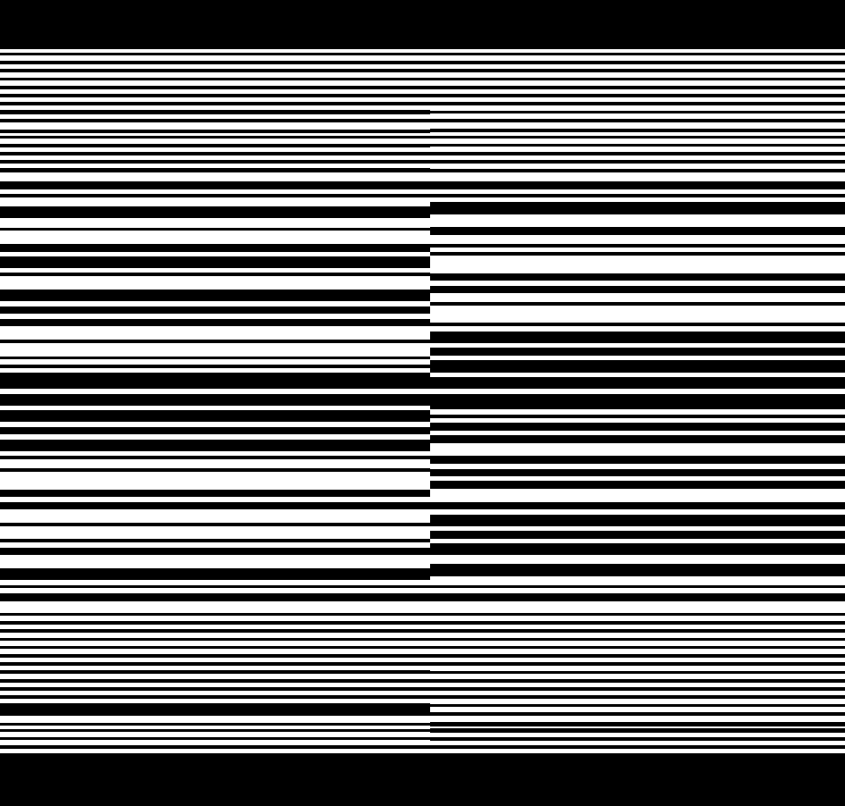

# Stego / Is it art ?

## Challenge
Rendez-vous au stand DGA lors de l’European Cyber Week 2022 qui se tiendra à Rennes, un challenge se cache dans un des goodies qui vous seront offerts.

Saurez-vous le retrouver et le résoudre ?

## Inputs
- logo:  [barcode-png.png](./barcode-png.png)


## Solution
There is some bar code in the background of the image.



To retrieve it, we first need to get rid of the logo itself, then reconstruct the bar code, finally decode it.


To get rid of the logo itself, we just zero all the pixels within a circle a little bit smaller than the logo itself. Since It is not exactly centered in the image, we need to find its center and radius first:

```python
    # Logo is not quite cented in the image: find the logo center and its radius
    c_x, c_y, radius = center_logo(f, pix, W, H)
    # Mask the logo by zeroing all the pixel within a circle a little bit smaller than the logo itself
    # So that a bit of the barcode is left around
    c_logo = radius - 45
    c_border = radius - 30
    for x in range(W):
        for y in range(H):
            # Remove the logo and the border
            d = sqrt( (x - c_x)**2 + (y - c_y)**2)
            if d <= c_logo or d >= c_border:
                pix[x, y] = WHITE
```

Here's the output, where the logo has been successfully removed:



Next step is to continue the lines of the barcode, so that we can later decode it. We do this scanning the cleaned image line per line, by detecting a color change (we need to convert to black and white before though).

And while doing so, we realize there are actually two bar codes ! One on the left, one on the right. So when continuing the lines, we shall stop at the center of the image:

```python
    # Now continue the lines of the barcode, by scanning the image line per line
    # If we detect color white (resp. black), we continue with white (resp. black)
    # We need to convert to black & white before though
    # Omg, there are two bar codes, one one the left, one on the right !!!
    img = img.convert('1')
    pix = img.load()
    for y in range(H):
        # Count the number of black / white pixels between then logo and the border circles
        # This is to identify the most probable color for the line
        # Do this once for the left barcode, once for the righr barcode
        count_left  = [0] * 2
        count_right = [0] * 2
        for x in range(W):
            d = sqrt( (x - c_x)**2 + (y - c_y)**2)
            if d > c_logo and d < c_border:
                p = int(pix[x, y]) // 255
                if x <= c_x:
                    count_left[p] += 1
                else:
                    count_right[p] += 1
        color_left  = count_left.index(max(count_left))
        color_right = count_right.index(max(count_right))
        # Continue the lines inside the logo with the most probable color found before, for both parts (left, right)
        for x in range(W):
            d = sqrt( (x - c_x)**2 + (y - c_y)**2)
            if x <= c_x:
                pix[x,y] = color_left
            else:
                pix[x,y] = color_right
```

Here's the output, where the two bar codes have been restored



Time to decode them now. There must be some python library to decode them, but I started to implemented it myself for fun as follow. Not too wise, though, since there are code changes present in these bar codes (code128 implements 3 codes A, B, C with different encodings)...

```python
def decode_barcode(barcode):
    # Count consecutive values and build code128, considering line thickness is approx. 4 pixels
    cur = ''; count = 0; code128 = ''
    for new in barcode:
        if new != cur and count != 0:
            code = round(count // 4)
            if code == 0:
                code = 1
            elif code == 5:
                code = 4
            code128 += str(code)
            count = 1
        else:
            count += 1
        cur = new
    code128 += str(count)

    # Shall be a multiple of 6, so truncate if not
    code128 = code128[:len(code128)//6*6]
    #print(code128, len(code128))

    # Identify which 128code this is: A, B or C
    start = code128[0:6]
    if start == START_CODEA:
        code_set = 'A'
    elif start == START_CODEB:
        code_set = 'B'
    elif start == START_CODEC:
        code_set = 'C'
    else:
        code_set = 'unknown'
        return
    #print('Detected 128code', code_set)
    # Skip start
    code128 = code128[6:]

    # Break code128 string into code128 characters
    l = [code128[x:x+6] for x in range(0, len(code128), 6)]
    print(l)

    # Omg, there are code changes...
    # 95        5f      US      DEL     95      114113
    # 96        60      FNC 3   FNC 3   96      114311
    # 97        61      FNC 2   FNC 2   97      411113
    # 98        62      ShiftB  ShiftA  98      411311
    # 99        63      Code C  Code C  99      113141
    # 100       64      Code B  FNC 4   Code B  114131
    # 101       65      FNC 4   Code A  Code A  311141
    # (..)
    # 106       6a      Stop    —       —       233111
    # 107               Stop inversé    —       211133
    # 108               Stop pattern            2331112
    s = ''
    print('Start Code', code_set)
    for x in l:
        if x in CODE:
            # Handle code set changes
            index = CODE.index(x)
            if index == 101:
                code_set = 'A'; print('Switch Code A')
            elif index == 100:
                code_set = 'B'; print('Switch Code B')
            elif index == 99 and code_set != 'C':
                code_set = 'C'; print('Switch Code C')
            elif index == 106:
                print('Code STOP')
                break
            elif index >= 95:
                print(x + "not expected")
            else:
                # Handle encoding, depending on code set
                if code_set == 'C':
                    # Code C: HEX
                    c = unhexlify(str(index)).decode()
                    print(c)
                    s += c
                else:
                    # Code A or B: ASCII
                    c = chr(index + ASCII_OFFSET)
                    print(c)
                    s += c

        else:
            print(x, 'not in CODE')
            break

    # Some more cheating: the brakets are hex-encoded; Also need to drop the last one apparently...
    print(s)
    s = s.replace('7b', '{')
    s = s.replace('7d', '}')
    s = s[: -1]
    print(s)
    return s
```

Here is the execution output and the extracted flag:
```console
$ python3 sol.py
RIGHT
['132131', '133121', '231311', '114131', '312131', '121421', '231311', '233111']
Start Code C
D
G
A
Switch Code B
7
b
I
Code STOP
DGA7bI
DGA{

LEFT
['312131', '232121', '232121', '114131', '312131', '141221', '241112', '233111']
Start Code C
#
2
2
Switch Code B
7
d
n
Code STOP
#227dn
#22}


DGA{#22}
```

## Python code
Complete solution in [sol.py](./sol.py)

## Flag
DGA{#22}
